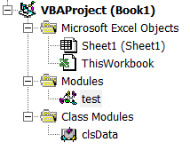

# SQL Server to Microsoft Excel

VBA class for Excel to make easy to access records stored in SQL Server and output these data in an Excel sheet; keeping or not the link

## Installation

1. Clone or download this repository
2. Start Excel
3. Open the Visual Basic Editor
4. In your Project explorer, right-click on `VBAProject` and select `Import File` and retrieve the `src\SQL2Excel.xlsm\clsData.cls` of this repository
5. Same for the module `src\SQL2Excel.xlsm\test.bas` of this repository

You should see something like this : 



Double-clic on the `test` module.

Before being able to run the demo subroutines, you'll need to specify three values : 

```VB
Private Const cServerName = ""   ' <-- You'll need to mention here your server name
Private Const cDBName = ""       ' <-- You'll need to mention here your database name
Private Const cSQLStatement = "" ' <-- You'll need to mention here a valid SQL statement (SELECT ...)
```

## Sample code

### CopyToSheet

*You'll find a demo in the module called `test`*

#### Description 

Get a recordset from the database and output it into a sheet.
This function make a copy not a link => there is no link
with the database, no way to make a refresh.

**Advantages**

Fast

**Inconvenient**

Don't keep any link with the DB, records are copied to Excel

#### Sample code:

```VB
 Dim cData As New clsData
 Dim rng As Range

    cData.ServerName = "srvName"
    cData.DatabaseName = "dbName"

    ' When cData.UserName and cData.Password are not supplied
    ' the connection will be made as "trusted" i.e. with the connected
    ' user's credentials

    Set rng = cData.SQL_CopyToSheet("SELECT TOP 5 * FROM tbl", ActiveSheet.Range("A1"))
```

### AddQueryTable

#### Description 

Create a query table in a sheet : create the connection, the query table, give it a name and get data.

**Advantages**

* Keep the connection alive. The end user will be able to make a Data -> Refresh to obtain an update of the sheet
* If the user don't have access to the database, the records will well be visible but without any chance to refresh them

**Inconvenient**

* If the parameter bPersist is set to True, the connection string will be in plain text in the file (=> avoid this if you're using a login / password).

#### Parameters

sSQL       : Instruction to use (a valid SQL statement like
             SELECT ... FROM ... or EXEC usp_xxxx)
sQueryName : Internal name that will be given to the querytable
rngTarget  : Destination of the returned recordset (f.i. Sheet1!$A$1)
bPersist   : If true, the connection string will be stored and, then, the
             user will be able to make a refresh of the query
             SECURIY CONCERN : IF USERNAME AND PASSWORD HAVE BEEN SUPPLIED,
             THESE INFORMATIONS WILL BE SAVED IN CLEAR IN THE CONNECTION
             STRING !

#### Sample code

```VB
Dim cData As New clsData
Dim sSQL As String

    cData.ServerName = "srvName"
    cData.DatabaseName = "dbName"
    cData.UserName = "JohnDoe"
    cData.Password = "Password"

    ' When cData.UserName and cData.Password are not supplied
    ' the connection will be made as "trusted" i.e. with the connected
    ' user's credentials

    sSQL = "SELECT TOP 1 * FROM tbl"

    Call cData.AddQueryTable(sSQL, "qryTest", ActiveCell, True)
```

### RunSQLAndExportNewWorkbook

#### Description 

This function will call the AddQueryTable function of this class but first will create a new workbook, get the data and format the sheet (add a title, display the "Last extracted date" date/time in the report, add autofiltering, page setup and more.

The obtained workbook will be ready to be sent to someone.

#### Parameters

sSQL         : Instruction to use (a valid SQL statement like
               SELECT ... FROM ... or EXEC usp_xxxx)
sReportTitle : Title for the sheet
bPersist     : If true, the connection string will be stored and, then, 
               the user will be able to make a refresh of the query
               SECURIY CONCERN : IF USERNAME AND PASSWORD HAVE BEEN SUPPLIED,
               THESE INFORMATIONS WILL BE SAVED IN CLEAR IN THE CONNECTION
                STRING !

#### Sample code

```VB
Dim cData As New clsData
Dim sSQL As String

    cData.ServerName = "srvName"
    cData.DatabaseName = "dbName"
    cData.UserName = "JohnDoe"
    cData.Password = "Password"

    sSQL = "SELECT TOP 1 * FROM tbl"

    Call cData.RunSQLAndExportNewWorkbook(sSQL, "My Title", False)
```